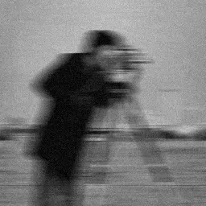
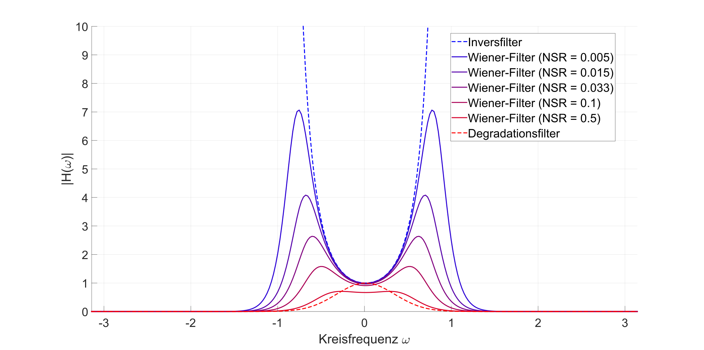
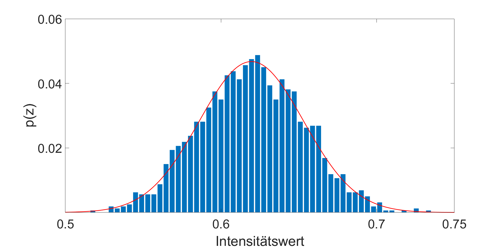
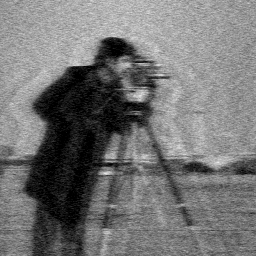

<div align="center">

# Wiener-Filter zur Bildrestauration  



### Digitale Bildverarbeitung · Hochschule München  
WiSe 2025  

Lukas Sambale · Stefan Weinhauser  
Betreuung: Prof. Dr.-Ing. Claudius Schnörr  

</div>

---
# Inhaltsverzeichnis

- [Symbolverzeichnis](#symbolverzeichnis)
- [Wiener-Filter in der digitalen Bildverarbeitung](#wiener-filter-in-der-digitalen-bildverarbeitung)
  - [Statistische Annahmen](#statistische-annahmen)
  - [Bildmodell (Degradation + Rauschen)](#bildmodell-degradation--rauschen)
  - [Optimierungsprinzip (MMSE und Orthogonalitätsprinzip)](#optimierungsprinzip-mmse-und-orthogonalitätsprinzip)
  - [Herleitung](#herleitung)
  - [Verhalten des Wiener-Filters](#verhalten-des-wiener-filters)
  - [Ermittlung des Rausch-Signal-Verhältnis](#ermittlung-des-rausch-signal-verhältnis)
    - [Schätzung der Rauschstatistik](#schätzung-der-rauschstatistik)
  - [Degradation des Bildes](#degradation-des-bildes)
    - [Lineare Bewegungsunschärfe (engl Motion Blur)](#lineare-bewegungsunschärfe-engl-motion-blur)
    - [Gaußsches Rauschen](#gaußsches-rauschen)
- [Bildrekonstruktion](#bildrekonstruktion)
  - [Bekannte Bilddaten (theoretischer Idealfall)](#bekannte-bilddaten-theoretischer-idealfall)
  - [Unbekannte Bilddaten (Realfall)](#unbekannte-bilddaten-realfall)
  - [Artefakte](#artefakte)
  - [Fazit](#fazit)
- [Anhang: MATLAB-Implementierung des Wiener-Filters](#anhang-matlab-implementierung-des-wiener-filters)

---

# Symbolverzeichnis

<div id="tab:placeholder">

| Symbol | Bezeichnung |
|:---|:---|
| $`a`$ | Verschiebungsdistanz während der Belichtung |
| $`e^2`$ | quadratischer Fehler |
| $`E\{\cdot\}`$ | Erwartungswertoperator |
| $`f(x,y) \overset{ℱ}{\longrightarrow} F(u,v)`$ | Originalbild |
| $`\hat{f}(x,y) \overset{ℱ}{\longrightarrow} \hat{F}(u,v)`$ | restauriertes Bild |
| $`g(x,y) \overset{ℱ}{\longrightarrow} G(u,v)`$ | verschlechtertes Bild |
| $`h(x,y) \overset{ℱ}{\longrightarrow} H(u,v)`$ | Degradationsfunktion |
| $`K`$ | Regularisierungsparameter |
| $`M`$ | Anzahl der Zeilen |
| $`MMSE`$ | Minimum Mean Square Error |
| $`MSE`$ | Mean Square Error |
| $`n(x,y) \overset{ℱ}{\longrightarrow} N(u,v)`$ | Rauschen |
| $`N`$ | Anzahl der Spalten |
| $`NSR`$ | Rausch-Signal-Verhältnis |
| $`p_n(z_i)`$ | Wahrscheinlichkeitsverteilung von $`z_i`$ |
| $`PDF`$ | Wahrscheinlichkeitsdichtefunktion |
| $`S_\eta(u,v)`$ | Leistungsdichtespektrum des Rauschens |
| $`S_f(u,v)`$ | Leistungsdichtespektrum des Bildes |
| $`T`$ | Belichtungszeit |
| $`W(u,v)`$ | Wiener-Filter im Frequenzraum |
| $`\hat{z}`$ | Mittelwert |
| $`z_i`$ | Intensität eines Pixels $`i`$ |
| $`\sigma`$ | Standardabweichung |
| $`\sigma^2`$ | Varianz |


</div>

<span id="tab:placeholder" label="tab:placeholder"></span>

# Wiener-Filter in der digitalen Bildverarbeitung

Der Wiener-Filter, auch als Minimum Mean Square Error (MMSE) -Filter
bezeichnet, ist ein stochastisches Verfahren zur Bildrestaurierung. Ziel
ist es, aus einem verschlechterten Bild eine statistisch optimale
Schätzung $`\hat{f}`$ des ursprünglichen Bildes $`f`$ zu bestimmen. Im
Gegensatz zu reinen Inversionsverfahren berücksichtigt der Wiener-Filter
die statistischen Eigenschaften von Bild und Rauschen explizit. Eine
frequenzabhängige Gewichtung auf Basis der Leistungsdichtespektren
dämpft stark verrauschte Frequenzanteile und bevorzugt
informationshaltige Komponenten, wodurch im statistischen Mittel ein
optimales Restaurierungsergebnis erzielt wird.

## Statistische Annahmen

Der Wiener-Filter basiert auf dem Ansatz, Bilder und Rauschen nicht als
deterministische Größen, sondern als Zufallsvariablen zu behandeln.
Dafür werden folgende zentrale Annahmen getroffen:

- Unkorreliertheit von Bild und Rauschen: Es wird vorausgesetzt, dass
  das Rauschen und das Bildsignal statistisch unabhängig voneinander
  sind.

- Zero Mean: Die Herleitung geht davon aus, dass entweder das Bildsignal
  oder das Rauschen (oder beide) einen Mittelwert von Null aufweisen

- Linearität: Die Schätzung des optimalen Bildes wird als eine lineare
  Funktion der Intensitätswerte des gestörten Bildes betrachtet. Auch
  der zugrunde liegende Verschlechterungsprozess (die Degradation H)
  wird als ein lineares System modelliert.[7]

## Bildmodell (Degradation + Rauschen)

Zunächst wird das lineare ortsinvariante Modell für ein verschmiertes
und verrauschtes Bild aufgestellt:
``` math
\begin{equation}
g(x,y) = h(x,y) * f(x,y) + n(x,y)
\end{equation}
```
wobei $`f(x,y)`$ das Originalbild, $`h(x,y)`$ die Degradationsfunktion,
$`n(x,y)`$ additives Rauschen und $`g(x,y)`$ das degradierte Bild ist.
Das Symbol $`*`$ bezeichnet die zweidimensionale Faltung. Durch
Anwendung der diskreten zweidimensionalen Fourier-Transformation wird in
den Frequenzraum transformiert:
``` math
\begin{equation}
G(u,v) = H(u,v)F(u,v) + N(u,v)
\end{equation}
```
Die Restauration des Bildes erfolgt durch einen linearen Filter
$`W(u,v)`$ im Frequenzraum. Das restaurierte Bild $`\widehat{F}(u,v)`$
ergibt sich dabei zu:
``` math
\begin{equation}
\widehat{F}(u,v) = W(u,v)G(u,v)
\end{equation}
```

## Optimierungsprinzip (MMSE und Orthogonalitätsprinzip)

Die Bestimmung des Wiener-Filters basiert auf dem
Orthogonalitätsprinzip. Es besagt, dass eine Schätzung $`\hat{f}`$ des
ursprünglichen Bildes $`f`$ genau dann optimal im Sinne des minimalen
mittleren quadratischen Fehlers ist, wenn der verbleibende Schätzfehler
orthogonal, also statistisch unkorreliert, zum beobachteten degradierten
Bild $`g`$ ist. Für Zufallsfelder in der Bildverarbeitung bedeutet
Orthogonalität, dass der Erwartungswert des Produkts aus Schätzfehler
und Beobachtung verschwindet:
``` math
\begin{equation}
E\{(\hat{f}-f)g\} = 0
\end{equation}
```
Das degradierte Bild $`g`$ spannt den Raum der verfügbaren
Bildinformationen auf, während die Schätzung $`\hat{f}`$ als Funktion
dieser Beobachtungen innerhalb dieses Raumes liegt. Die
Orthogonalitätsbedingung fordert, dass der minimale Schätzfehler
senkrecht zu diesem Informationsraum steht und somit keine verwertbaren
Bildinformationen mehr enthält. Der verbleibende Fehler ist dann reiner
Zufall, der in keinerlei Beziehung mehr zu den verfügbaren Daten steht
und somit mathematisch nicht weiter reduziert werden kann.[8]

## Herleitung

In dieser Arbeit wird der Wiener-Filter nicht direkt über die
Orthogonalitätsbedingung, sondern über den äquivalenten Ansatz der
expliziten Minimierung des mittleren quadratischen Fehlers hergeleitet.
Beide Vorgehensweisen führen auf dieselbe Optimallösung. Der
quadratische Fehler $`e^2`$ wird definiert als:

``` math
\begin{equation}
e^2 = (f(x,y)-\widehat{f}(x,y))^2
\end{equation}
```
Durch Einsetzen von $`\widehat{f}(x,y)=w(x,y)*g(x,y)`$ und
Transformation in den Frequenzraum ergibt sich der quadratische Fehler
für eine einzelne Frequenz (u,v) (vereinfacht ohne Indizes) zu:
``` math
\begin{equation}
|E_f|^2 = |F - WG|^2
= (F-WG)(F-WG)^*
\end{equation}
```
wobei $`(\cdot)^*`$ die komplexe Konjugation bezeichnet.\
Setzt man das
Modell <a href="#eq:modell_frequenzraum" data-reference-type="eqref"
data-reference="eq:modell_frequenzraum">[eq:modell_frequenzraum]</a>
ein, erhält man:
``` math
\begin{equation}
    E_f = F - W(HF + N) = F(1 - WH) - WN
\end{equation}
```
``` math
\begin{equation}
    |E_f|^2 = [F(1 - WH) - WN] \cdot [F(1 - WH) - WN]^*
\end{equation}
```
Das ergibt ausmultipliziert:
``` math
\begin{equation}
\begin{aligned}
|E_f|^2
&= |F(1 - WH)|^2
- \underbrace{F(1 - WH)(WN)^*}_{\text{Kreuzterm 1}}
- \underbrace{(F(1 - WH))^*(WN)}_{\text{Kreuzterm 2}}
+ |WN|^2
\end{aligned}
\end{equation}
```
Zur Berechnung des Mean Square Error (MSE) wird der
Erwartungswert-Operator angewandt:
``` math
\begin{equation}
    MSE = E\{|E_f|^2\}
\end{equation}
```
``` math
\begin{equation}
    MSE = E\{|F(1 - WH)|^2-F(1 - WH)(WN)^*-(F(1 - WH))^*(WN)+|WN|^2\} \notag
\end{equation}
```
Hier kommen die statistischen Annahmen zum Tragen: Die angenommene
Unkorreliertheit des Rauschens und des Bildsignals hat zur Folge, dass
der Erwartungswert des Produkts von Bild und Rauschen Null ergibt und
die Kreuzterme 1 und 2 entfallen:
``` math
\begin{equation}
E\{F \cdot N^*\} = 0 \quad \text{und} \quad E\{F^* \cdot N\} = 0
\end{equation}
```
``` math
\begin{equation}
MSE=E\{|F(1 - WH)|^2\}+E\{|WN|^2\}
\end{equation}
```
Da $`W`$ und $`H`$ feste Filterfunktionen (keine Zufallsvariablen) sind,
können konstante Terme vor den Erwartungswert gezogen werden:
``` math
\begin{equation}
MSE = |1 - WH|^2 \cdot E\{|F|^2\} + |W|^2 \cdot E\{|N|^2\}
\end{equation}
```
Diese Erwartungswerte der quadrierten Beträge entsprechen den
Leistungsdichtespektren:

- $`S_f(u,v) = \mathbb{E}\{|F(u,v)|^2\}`$: Leistungsspektrum des
  Originalbildes.

- $`S_\eta(u,v) = \mathbb{E}\{|N(u,v)|^2\}`$: Leistungsspektrum des
  Rauschens.

Durch Ausmultiplizieren mit ($`|1 - WH|^2 = (1 - WH)(1 - W^* H^*)`$)
folgt:
``` math
\begin{equation}
MSE = (1 - WH - W^* H^* + |W|^2 |H|^2)\, S_f + |W|^2 S_\eta
\end{equation}
```
Da der Filterkoeffizient $`W(u,v)`$ im Frequenzbereich komplex ist,
handelt es sich bei der MSE-Funktion um eine reellwertige Funktion einer
komplexen Variablen. Eine direkte Ableitung nach $`W`$ ist daher nicht
zulässig. Stattdessen wird der Wirtinger-Kalkül verwendet, bei dem $`W`$
und $`W^*`$ als formal unabhängige Variablen betrachtet werden. Für
reellwertige Kostenfunktionen ist das Minimum erreicht, wenn die
Ableitung nach dem komplex konjugierten Parameter verschwindet.[9] Aus
diesem Grund wird das Minimum des Fehlers gefunden indem der Ausdruck
nach $`W^*`$ abgeleitet wird und das Ergebnis gleich Null gesetzt wird:
``` math
\begin{equation}
    \frac{\partial MSE}{\partial W^*}=- H^* S_f+ W |H|^2 S_f+ W S_\eta= 0
\end{equation}
```
Die resultierende Gleichung kann nach $`W`$ aufgelöst werden und ergibt
den Wiener-Filter im Frequenzbereich:[10]
``` math
\begin{equation}
    W ( |H|^2 S_f + S_\eta ) = H^* S_f \notag
\end{equation}
```
``` math
\begin{equation}
W(u,v)=\frac{H^*(u,v) S_f(u,v)}{|H(u,v)|^2 S_f(u,v) + S_\eta(u,v)}
\end{equation}
```
Da die Leistungsspektren von Bild und Rauschen meist unbekannt sind wird
die Gleichung durch Kürzen mit $`S_f(u,v)`$ in eine vereinfachte Form
mit dem Rausch-Signal-Verhältnis $`NSR(u,v)`$(engl. Noise-to-Signal
Ratio) überführt:
``` math
\begin{equation}
    NSR(u,v) = \frac{Leistungsdichtespektrum\ des\ Rauschens}{Leistungsdichtespektrum\ des\ Originalbildes}=\frac{S_\eta(u,v)}{S_f(u,v)}
\end{equation}
```
``` math
\begin{equation}
W(u,v) = \left[\frac{H^*(u,v)}{|H(u,v)|^2 + S_\eta(u,v)/S_f(u,v)}\right]
\end{equation}
```
``` math
\begin{equation}
W(u,v) = \left[\frac{H^*(u,v)}{|H(u,v)|^2 + NSR(u,v)}\right]
\end{equation}
```
``` math
\begin{equation}
W(u,v)=\frac{1}{H(u,v)}\left[ \frac{1}{1+\frac{NSR(u,v)}{|H(u,v)|^2}}\right]
\end{equation}
```

## Verhalten des Wiener-Filters

Aus der umgestellten
Wiener-Filter-Gleichung geht hervor,
dass der Wiener-Filter im Wesentlichen einem Inversfilter mit
zusätzlichem, frequenzabhängigen Gewichtungsterm zur Steuerung der
Rauschunterdrückung entspricht. Für ein hohes NSR nimmt der
Gewichtungsterm einen kleinen Wert an, wodurch die entsprechende
Frequenzkomponente stark abgeschwächt wird. Ist das NSR hingegen klein,
d. h. der Rauschanteil ist gering, geht der Gewichtungsterm gegen Eins.
In diesem Fall entspricht der Wiener-Filter näherungsweise dem
Inversfilter. Der im Gewichtungsterm enthaltene Faktor $`|H(u,v)|^2`$
stellt sicher, dass Frequenzanteile, die durch den Degradationsprozess
stark gedämpft oder vollständig unterdrückt wurden, nicht verstärkt
werden. Dadurch verhindert der Wiener-Filter eine unkontrollierte
Verstärkung von Rauschen in Frequenzbereichen, in denen keine
verlässliche Bildinformation vorhanden ist.
Abbildung <a href="#fig:freq_vergleich" data-reference-type="ref"
data-reference="fig:freq_vergleich">1</a> zeigt die
Übertragungsfunktionen des Wiener-Filters für unterschiedliche konstante
NSR-Werte. Sie verdeutlicht das verhalten eines Inversfilters und dessen
Ähnlichkeit mit einem Wiener Filter kleiner NSRs hin zu einer glättenden
Filtercharakteristik bei größeren NSRs.

<div align="center">



<p>
<b>Abbildung:</b> Vergleich der Frequenzgänge von Inversfilter,
Wiener-Filter und Degradationsfilter
</p>

</div>

## Ermittlung des Rausch-Signal-Verhältnis

Da die Leistungsdichtespektren $`S_f(u,v)`$ und $`S_\eta(u,v)`$ für ein
unbekanntes Originalbild in der Praxis nicht vorliegen, wird das
eigentlich frequenzabhängige Rausch-Signal-Verhältnis häufig durch den
skalaren Regularisierungsparameter K approximiert. Damit werden bei der
Rekonstruktion alle Frequenzen, unabhängig des tatsächlichen Anteils des
Rauschens, gleich behandelt. K kann entweder experimentell durch
visuelle Beurteilung des rekonstruierten Bildes oder wie in dieser
Arbeit durch eine Schätzung aus dem Quotienten der Varianzen von
Rauschen und Signal ermittelt werden. Dabei wird die Varianz als Maß der
mittleren Leistung herangezogen, da sie im Gegensatz zum Mittelwert
ausschließlich die Intensitätsschwankungen um den Gleichanteil und damit
die strukturell relevanten AC-Anteile (Wechselanteile) wie Kanten und
Texturen des Bildes beschreibt.

### Schätzung der Rauschstatistik

Zur Schätzung der Varianz des Rauschens $`\sigma_n^2`$ wird im
degradierten Bild eine möglichst strukturlose, monochrome Bildregion
ausgewählt, deren Pixel im Originalbild einen konstanten Grauwert
aufweisen würden. Die vorhandenen Intensitätsschwankungen in diesem
Ausschnitt können daher dem Rauschen zugeschrieben werden. Aus dem
normierten Histogramm des Bildausschnitts wird so die Art und Varianz
des Rauschens ermittelt. Für eine 8 Bit Darstellung mit $`L=256`$
möglichen Graustufen und den Intensitätswerten $`z_i`$ liefert das
normierte Histogramm des Bildausschnitts die
Wahrscheinlichkeitsverteilung $`p_n(z_i)`$, aus der sich der Mittelwert
$`\hat{z}`$ und die Varianz $`\sigma_n^2`$ des Rauschens berechnen
lassen, wobei $`\sigma_g^2`$ die Varianz des degradierten Bildes und
$`\sigma_f^2`$ die Varianz des Originalbildes bezeichnet.[7] 
``` math
\begin{equation}
\hat{z} = \sum_{i=0}^{L-1} z_i \, p_n(z_i).
\end{equation}
```
``` math
\begin{equation}
\sigma_n^2 = \sum_{i=0}^{L-1} (z_i - \hat{z})^2 \, p_n(z_i).
\end{equation}
```
``` math
\begin{equation}
\sigma_f^2 \approx \sigma_g^2 - \sigma_n^2.
\end{equation}
```
``` math
\begin{equation}
K \approx  \frac{\sigma_n^2}{\sigma_f^2}.
\end{equation}
```


## Degradation des Bildes

Die mathematische Darstellung von Bildstörungen ist Voraussetzung für
die Bildrestaurierung mithilfe des Wiener Filters. Physikalische
Einflüsse wie Bewegungen zwischen Kamera und Bild während der
Belichtung, aber auch Sensorrauschen müssen in ein Modell überführt
werden.

### Lineare Bewegungsunschärfe (engl. Motion Blur)

Lineare Bewegungsunschärfe resultiert aus der relativen Bewegung
zwischen Sensor und Objekt. Die Berechnung der Degradationsfunktion
$`H(u,v)`$ basiert auf dem in [7] beschriebenen Modell. Unter der Annahme,
dass sich der Verschluss (engl. Shutter) augenblicklich öffnet und
schließt und der optische Abbildungsprozess ideal ist, können die durch
die Bewegung verursachten Effekte isoliert werden. Das verschlechterte
Bild $`g(x,y)`$ wird durch Integration der zeitabhängigen
Verschiebungskomponenten $`x_0(t)`$ und $`y_0(t)`$ modelliert und ergibt
sich mit der Belichtungszeit T zu:

``` math
\begin{equation}
 g(x,y) = \int_{0}^{T} f\!\bigl[x - x_0(t),\, y - y_0(t)\bigr] \, dt
\end{equation}
```
Angenommen die Lineare Bewegung in y-Richtung ist Null $`y_0(t)=0`$ und
die Variable $`x_0(t)`$ ist bekannt, folgt für die Transferfunktion:
``` math
\begin{equation}
H(u,v) = \int_{0}^{T}e^{-j 2\pi  u x_0(t) } \, dt
\end{equation}
```
Nehmen wir zusätzlich die Bewegung in x-Richtung als linear an, so
bewegt sich das Bild mit der konstanten Geschwindigkeit $`a/T`$, sodass
$`x_0(t)=\frac{at}{T}`$. Hier beschreibt a die Verschiebungsdistanz
während der Belichtung. Durch einsetzten in das Integral und Integration
folgt:
``` math
\begin{equation}
H(u,v) = \frac{T}{\pi u a } \,\sin \,(\pi u a ) \,e^{-j \pi u a }
\end{equation}
```
Um eine diskrete Übertragungsfunktion der Größe M x N zu erhalten, muss
die Gleichung über die gesamte Größe abgetastet werden. Durch
Multiplikation mit dem Originalbild im Frequenzraum ergibt sich ein
degradiertes Frequenzspektrum.

<table align="center">
<tr>

<td align="center" width="50%">

<br>
Originalbild
</td>

<td align="center" width="50%">

<br>
Bewegungsunschärfe
</td>

</tr>
</table>

<p align="center">
<b>Abbildung:</b> Originalbild und Ergebnis der Bilddegradation
durch lineare Bewegungsunschärfe mit $a = 25$ und $T = 1$.
</p>

### Gaußsches Rauschen

Ein häufig verwendetes Rauschmodell in der digitalen Bildverarbeitung
ist das gaußsche Rauschen. Es beschreibt zufällige
Intensitätsschwankungen, die unter anderem durch Sensorrauschen oder
elektronische Störeinflüsse entstehen können. In dieser Arbeit wird
gaußsches Rauschen mit einem Mittelwert von $`\mu = 0`$ erzeugt, indem
mehrere gleichverteilte Zufallsvariablen aufsummiert und anschließend
normiert werden. Dieses Vorgehen ist zulässig, da die Summe unabhängiger
Zufallsvariablen gegen eine Normalverteilung konvergiert. Die
resultierende Rauschmatrix wird mit der gewünschten Standardabweichung
skaliert und anschließend gemäß dem
Model <a href="#eq:modell_ortsraum" data-reference-type="eqref"
data-reference="eq:modell_ortsraum">[eq:modell_ortsraum]</a> auf das
degradierte Bild addiert.

Es wird additives gaußsches Rauschen mit einer Varianz von
$`\sigma^2 = 60`$ verwendet. Die Standartabweichung des Rauschens
beträgt demnach $`7,746`$ Grauwerte. Dieses Rauschmodell beschreibt
signalunabhängige Störungen, wie sie typischerweise bei Bildsensoren
auftreten. Für den Wiener Filter ist die Unabhänigkeit wie in
Kapitel <a href="#subsec:Annahmen" data-reference-type="ref"
data-reference="subsec:Annahmen">1.1</a> bereits beschrieben eine feste
Annahme. Die Wahl der Varianz bestimmt die Stärke des Rauschens und
erlaubt eine kontrollierte Simulation realistischer Bilddegradation. Das
Rauschen wird additiv auf das degradierte Bild aufgebracht:

<table align="center">
<tr>

<td align="center" width="33%">

<br>
Originalbild
</td>

<td align="center" width="33%">

<br>
Bewegungsunschärfe
</td>

<td align="center" width="33%">

<br>
Bewegungsunschärfe + Rauschen
</td>

</tr>
</table>

<p align="center">
<b>Abbildung:</b> Originalbild und degradierte Bilder nach Anwendung von Bewegungsunschärfe und anschließend additivem gaußschem Rauschen mit Varianz 60.
</p>

# Bildrekonstruktion

Zur Rekonstruktion des Degradierten Bildes $`g(x,y)`$ wird der Wiener
Filter aus
Gleichung <a href="#eq:wiener_filter" data-reference-type="eqref"
data-reference="eq:wiener_filter">[eq:wiener_filter]</a> verwendet.
Durch Multiplikation mit dem Degradierten Bild und dem $`NSR`$ ergibt
sich für das Rekonstruierte Bild im Frequenzraum $`\hat{F}(u,v)`$:
``` math
\begin{equation}
\hat{F}(u,v) =
\frac{H^{*}(u,v)}{|H(u,v)|^{2} + NSR}
\, G(u,v)
\end{equation}
```
Die Degradationsfunktion wird in dieser Arbeit als bekannt angenommen.
Diese Annahme ist in vielen praktischen Anwendungen zulässig, da
bestimmte Bilddegradationen, wie beispielsweise Bewegungsunschärfe, aus
den Aufnahmeeigenschaften der Kamera rekonstruiert oder mithilfe
integrierter Inertialmesseinheiten bestimmt werden können.[7] 

## Bekannte Bilddaten (theoretischer Idealfall)

Beginnend soll der Fall betrachtet werden, bei welchem sowohl das
Originalbild als auch das Rauschen bekannt sind. Dieser Fall tritt ein,
wenn das Bild wie hier erst künstlich verschlechtert wird. Das $`NSR`$
kann dabei exakt aus den Leistungsdichtespektren von Originalbild und
Rauschen bestimmt werden. Anmerkend zu erwähnen ist, dass das $`NSR`$ in
diesem Fall einer Matrix der Größe des Bildes entspricht. Das
Rekonstruierte Bild wird im Frequenzraum berechnet und anschließend
Rücktransformiert:


<div align="center">


<p>
<b>Abbildung:</b> Ideale Wiener-Rekonstruktion $\hat{f}_{\text{ideal}}(u,v)$ mit <p>
$$
NSR=\frac{S_{\eta}(u,v)}{S_f(u,v)}
\quad
MSE=0.0051
$$
</p>
</p>

</div>

Das Rekonstruierte Bild zeigt wesentlich schärfere Kanten. Jedoch ist
noch ein deutlicher Unterschied zum Originalbild zu erkennen. Um diese
Abweichungen mit einem einzigen Wert beschreiben zu können wird hier der
MSE als Gütekriterium genutzt:
``` math
\begin{equation}
MSE = \frac{1}{MN} \sum_{x=1}^{M} \sum_{y=1}^{N}
\left( f(x,y) - \hat{f}(x,y) \right)^2
\end{equation}
```
Für diese Berechnung wird auch das Originalbild benötigt. Der MSE wird
auch im Folgenden genutzt, um die Qualität der Rekonstruktion zu
bewerten und die Schätzung des Rausch Signal Verhältnisses zu
validieren.

## Unbekannte Bilddaten (Realfall)

Im Folgenden wird der eigentliche Anwendungsfall des Wiener Filters
beschrieben, bei dem sowohl das Originalbild, als auch das Rauschen
unbekannt sind. Es gilt eine geeignete Schätzung für das NSR zu finden.
Dazu wird wie in
Kapitel <a href="#subsec:ErmittlungNSR" data-reference-type="ref"
data-reference="subsec:ErmittlungNSR">1.6</a> beschrieben zunächst das
normierte Histogram des Bildausschnitts ausgewertet(siehe Abbildung
 <a href="#fig:Histogramm" data-reference-type="ref"
data-reference="fig:Histogramm">5</a>). Die Intensitätsverteilung zeigt
eine annähernd gaußförmige Verteilung aus der sich eine
Standardabweichung $`\sigma_n`$ von 8.5932 berechnet. Dieser Wert liegt
nahe an der in
 <a href="#subsec:gaußschesRauschen" data-reference-type="ref"
data-reference="subsec:gaußschesRauschen">1.7.2</a> beschriebenen
tatsächlichen Standardabweichung von 7,746. Analog wird $`\sigma_g`$ aus
dem Histogramm von $`g(x,y)`$ geschätzt. Aus der Differenz der Varianzen
wird $`\sigma_f^2`$ geschätzt und gemäß der Gleichung
 <a href="#eq:KausVarianz" data-reference-type="eqref"
data-reference="eq:KausVarianz">[eq:KausVarianz]</a> der
Regularisierungsparameter K gebildet. Mit dem geschätzten Rausch zu
Signal Verhältnis von $`K\approx0,026`$ wird das Bild rekonstruiert:

<table align="center">
<tr>

<td align="center" width="50%">

<br>
Normiertes Histogramm des Bildausschnitts
</td>

<td align="center" width="50%">

<br>
Wiener-Rekonstruktion $\hat{f}_{\text{real}}(u,v)$  
<br>
$K = 0.026 MSE = 0.0094$  
<br>
</td>

</tr>
</table>

<p align="center">
<b>Abbildung:</b> Histogramm des ausgewählten Bildausschnitts und
Rekonstruktion mit geschätztem Rausch-Signal-Verhältnis.
</p>

Zur Validierung des berechneten K wird der Referenzwert durch mehrere
benachbarte Werte ergänzt. Dazu werden vier zusätzliche Werte
logarithmisch um den Referenzwert verteilt. Diese logarithmische
Skalierung ermöglicht außerdem eine robuste Bewertung der Sensitivität
der Wiener-Rekonstruktion gegenüber Abweichungen des NSR:

<table align="center">
<tr>

<td align="center" width="25%">

<br>
K = 0.0026<br>
MSE = 0.0511
</td>

<td align="center" width="25%">

<br>
K = 0.0122<br>
MSE = 0.0122
</td>

<td align="center" width="25%">

<br>
K = 0.0564<br>
MSE = 0.0100
</td>

<td align="center" width="25%">

<br>
K = 0.262<br>
MSE = 0.032
</td>

</tr>
</table>

<p align="center">
<b>Abbildung:</b> Logarithmische Variation des Parameters K bei der Wiener-Rekonstruktion.
</p>


Für kleine Werte von K werden Bilddetails stärker rekonstruiert. Dies
führt zu einer höheren Schärfe, verstärkt jedoch gleichzeitig das
vorhandene Rauschen. Für große Werte von K dominiert der
Gewichtungsterm. Das resultierende Bild ist stärker geglättet, weist
weniger Rauschen auf, verliert jedoch an Schärfe und Detailinformation.
Der Parameter K im Wiener-Filter ist immer ein Kompromiss zwischen
Schärfe und Rauschunterdrückung. Die Wahl von K ist entscheidend und
maßgeblich für die Stabilität des Filter wie bereits in
Kapitel <a href="#subsec:FilterVerhalten" data-reference-type="ref"
data-reference="subsec:FilterVerhalten">1.5</a> näher erläutert.

## Artefakte

Bei der Anwendung des Wiener-Filters zur Rekonstruktion von
bewegungsunscharfen Bildern können typische Artefakte auftreten.
Insbesondere sogenanntes Ghosting entsteht durch die Überbetonung
bestimmter Frequenzanteile, die durch die Degradationsfunktion der
Bewegungsunschärfezuvor stark abgeschwächt wurden. Da Kanten alle
Frequenzanteile enthalten, werden sie bei der Inversion besonders
empfindlich verstärkt und können zu Mehrfachkonturen oder Nachbildern
führen. Obwohl der Wiener-Filter die direkte Division durch Null
vermeidet, werden Frequenzen mit kleinen Beträgen von $`|H(u,v)|`$
weiterhin stark gewichtet, sofern der Regularisierungsterm nicht
ausreichend groß gewählt ist.

Zusätzlich kann es zu sogenanntem Mottling kommen, bei dem homogene
Bildbereiche fleckig oder inhomogen erscheinen, da hochfrequente
Rauschanteile übermäßig verstärkt werden. In den Rekonstruierten Bildern
mit variierendem Regularisierungsfaktor K sind diese Artefakte gut zu
erkennen. Das Ghosting ist in Form eines weiteren Umrisses um den
Kameramann zu sehen. Motlling ist dort eher als normalverteiltes
Rauschen und bei hohen Werten von K nur wenig zu sehen. Stärker
ausgeprägt ist das Mottling bei der idealen Rekonstruktion mit bekanntem
NSR. Der Grund dafür liegt in der frequenzabhängigen Gewichtung des
Filters: In Frequenzbereichen, in denen das Bildspektrum kleine Werte
annimmt, wird das NSR sehr groß, wodurch hochfrequente Rauschanteile
lokal stark verstärkt werden. Diese frequenzselektive Überverstärkung
führt insbesondere in zuvor homogenen Bildregionen zu inhomogenen,
fleckenartigen Strukturen. Im Gegensatz dazu wirkt ein konstanter
NSR-Wert als eine gleichmäßige Dämpfung. Diese wirkt auch auf kritische
Frequenzen und bewirkt somit eine visuell stabilere Rekonstruktionen.[7] 

## Fazit

Der Wiener-Filter stellt ein optimales Rekonstruktionsverfahren im Sinne
des mittleren quadratischen Fehlers dar. Durch die explizite
Berücksichtigung von Rauscheinflüssen ermöglicht er eine stabilere
Rekonstruktion als reine Inversionsverfahren. Der
Regularisierungsparameter steuert dabei den Kompromiss zwischen
Schärferückgewinnung und Rauschunterdrückung. Kleine Werte von K führen
zu schärferen Rekonstruktionen, verstärken jedoch das Rauschen, während
große Werte eine stärkere Glättung bewirken. Die richtige Wahl des
Parameters ist maßgeblich für die visuelle Qualität des rekonstruierten
Bildes. Eine perfekte Rekonstruktion ist jedoch grundsätzlich nicht
möglich, da Frequenzanteile mit $`H(u,v)=0`$ vollständig verloren gehen
und nicht wiederhergestellt werden können.

## Anhang: MATLAB-Implementierung des Wiener-Filters

Die in den vorherigen Kapiteln beschriebenen Schritte zur
Bilddegradation und Wiener-Rekonstruktion wurden vollständig in MATLAB
umgesetzt. Der Programmcode ist in [WienerFilterLukas.mlx](WienerFilterLukas.mlx) zu finden und zur Ansicht in [WienerFilterGruppe8.md](WienerFilterGruppe8.md) im markdown Format. Standardfunktionen werden lediglich für
grundlegende Operationen wie Fourier-Transformationen und
Bilddarstellung verwendet, während die eigentliche Signalverarbeitung
explizit selbst implementiert ist. Die Bilddegradation kann wahlweise
über eine gaußsche Punktspreizfunktion oder über lineare
Bewegungsunschärfe erfolgen. In beiden Fällen wird die jeweilige
Degradationsfunktion direkt aus dem zugrunde liegenden analytischen
Modell berechnet und nicht über vorgefertigte Filterfunktionen erzeugt.
Ebenso werden das additive gaußsche Rauschen, die NSR-Schätzung sowie
die Wiener-Filterübertragungsfunktion vollständig manuell berechnet und
zusammengesetzt. Die Rekonstruktion erfolgt ausschließlich über
elementweise Operationen im Frequenzraum ohne Verwendung von
MATLAB-internen Restaurations- oder Regularisierungsfunktionen. Sowohl
der Idealfall mit bekanntem, frequenzabhängigem NSR als auch der
praxisnahe Realfall mit konstantem K sind implementiert. Zur Bewertung
der Ergebnisse werden rekonstruierte Bilder für unterschiedliche K-Werte
erzeugt und über den mittlere quadratische Fehler mit dem Originalbild
verglichen. Ergänzend werden Frequenzgangvergleiche zwischen
Inversfilter, Wiener-Filter mit verschiedenen Werten von K und der
Degradationsfunktion dargestellt.


## Literatur

[1] Rafael C. Gonzalez and Richard E. Woods.
*Digital Image Processing*. 4th ed. Boston: Pearson, 2018.

[2] Thomas Kailath.
*Lectures on Wiener and Kalman Filtering*. Vienna: Springer, 1981.

[3] David H. Brandwood.
*A complex gradient operator and its application in adaptive array theory.*
In: IEE Proceedings F, vol. 130, no. 1, 1983, pp. 11–16.

[4] Norbert Wiener.
*Extrapolation, Interpolation, and Smoothing of Stationary Time Series: With Engineering Applications*.
Cambridge, MA: MIT Press, 1949.

[5] Prof. Dr.-Ing. Claudius Schnörr. Skript *Digitale Bildverarbeitung*.
Fakultät für Informatik und Mathematik. Hochschule München, WiSe 2025/2026.

------------------------------------------------------------------------
