# Bild Laden
```matlab
Originalbild = imread('cameraman.tif');
Originalbild = double(Originalbild)/255;
[M, N] = size(Originalbild);
imshow(Originalbild);
title('Originalbild (normalisiert)');
```

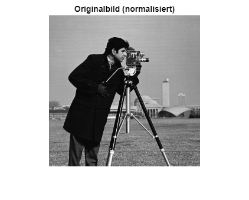

```matlab
OriginalbildFT = fft2(Originalbild);
dispFreqDomainAmplitude(OriginalbildFT,"Originalbild im Frequenzdomände")
```

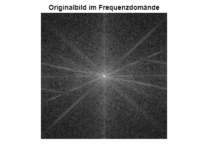
# Degradation
```matlab
degradationsart= "psf"
```

```matlab

switch degradationsart    
```
## Degradation mit gaußscher point spread function
```matlab
    case "psf"    
        psf_centered = fspecial('gaussian', [M N], 3); %PSF erzeugen
        psf = ifftshift(psf_centered);
        H = fft2(psf);
        BildDegradedFT = H.*OriginalbildFT;%Verschwommenes Bild im Frequenzraum
        BildDegraded = ifft2(BildDegradedFT);%verschwommenes Bild

        %Plotten
        mesh(psf_centered)
        title("psf im Ortsbereich")
        dispFreqDomainAmplitude(H,"psf im Frequenzraum")
        dispFreqDomainAmplitude(BildDegradedFT,"Bild nach Degdadation mit Gauß im Frequenzraum")
        figure; imshow(BildDegraded)
        title("Bild nach Degradation mit Gauß")
        
```
## Degradation Motion Blurr in x\-Richtung
```matlab
    case "motion"
        T = 1; %Belichtungszeit
        a = 25; %Verschiebungsdistanz
        
        H = Motionblur(Originalbild,a,T); %Funktionsaufruf zur erzeugung von H
        H=ifftshift(H);

        BildDegradedFT = H.*OriginalbildFT; % Degradation durch Multiplikation im Frequenzbereich
        BildDegraded = real(ifft2(BildDegradedFT)); %Rücktransformation

        %plotten
        dispFreqDomainAmplitude(H,"H(u,v) Motion Blur")
        dispFreqDomainAmplitude(BildDegradedFT,"Bild nach MotionBlur im Frequenzraum")
        figure; imshow(abs(BildDegraded), []); 
        title("Bild nach MotionBlur")
end
```

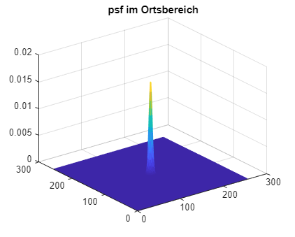

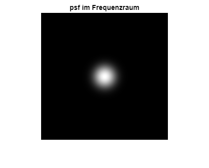

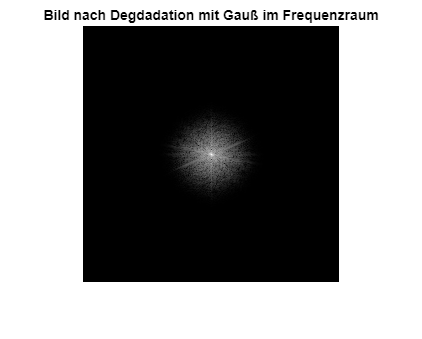

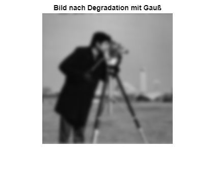
# Additives Rauschen mit Wahrscheinlichkeitsdichtefunktion (PDF)

Die Rauschkomponente wird als Bild gleicher Größe wie das Eingangsbild modelliert. Jedes Pixel dieses Rauschbildes ist eine Zufallsvariable, deren Werte einer bestimmten Wahrscheinlichkeitsdichtefunktion (Probability Density Function, PDF) folgen. Durch Addition dieses Rauschbildes zum Originalbild entsteht ein gestörtes Bild.

# Gaußsche Wahrscheinlichkeitsdichtefunktion

Ein häufig verwendetes Rauschmodell in der digitalen Bildverarbeitung ist das **gaußsche Rauschen**. Die zugehörige Wahrscheinlichkeitsdichtefunktion ist definiert als

 $$ p(z)=\frac{1}{\sqrt{2\pi }\,\sigma }\,e^{-\frac{(z-\hat{z} )^2 }{2\sigma^2 }} ,~~-\infty <z<\infty $$ 

mit z als Intensität und z\_hat als mean (average) Wert von z 

```matlab
% Parameter des Rauschens
mu = 0;        % Mittelwert
sigma_echt = sqrt(60); % Standardabweichung aus Varianz
fprintf('Sigma Rauschen = %.4f\n', sigma_echt);
```

```matlabTextOutput
Sigma Rauschen = 7.7460
```

```matlab
sigma = sigma_echt/255; % Standardabweichung für normierten Pixel-Wertebereich [0...1]
n=5;% n Bilder aus Zufallszahlen [0:1]

random = (rand(M, N, n)); 
random = sum(random,3) -n/2; % Summieren für Gaußverteilung und Mittelwert auf 0
random= random / sqrt(n/12); % Normierung
noise_gauss = sigma * random; % Normalverteilung einrechnen
noisy_img = double(BildDegraded) + noise_gauss; %Rauschbild erzeugen
noisy_img = min(max(noisy_img, 0), 1); % Clipping auf gültigen Wertebereich

%plotten
figure;
imshow(noisy_img,[]);
title("Verrauschtes und degradiertes Bild");
```


# Ermittlung des NSR / K
## Ermittlung von $S_{\textrm{nn}}$ 

Zur Schätzung der Rauschstatistik wird im degradierten Bild eine möglichst strukturlose, homogene Bildregion ausgewählt, deren Intensitätswerte idealerweise konstant sind. Alternativ kann unter identischen Aufnahmebedingungen ein Bild eines gleichmäßig beleuchteten, einfarbigen Hintergrunds aufgenommen werden. Aus der gewählten Region wird ein Bildausschnitt extrahiert und dessen Grauwertverteilung analysiert. Da in solchen Bereichen Signalanteile nahezu konstant sind, können Intensitätsschwankungen dem Rauschen zugeschrieben werden.


Das Histogramm des Bildausschnitts wird zu einer Wahrscheinlichkeitsverteilung normiert. Sei L die Anzahl möglicher Intensitätsstufen (bei 8 Bit: L=256) und z\_i der i\-te Intensitätswert. Mit der geschätzten Wahrscheinlichkeit ps(zi) ergeben sich der Mittelwert der Verteilung und die Varianz zu

 $$ \hat{z} =\sum_{i=0}^{L-1} z_i \,p_S (z_i ) $$ 

 $$ \sigma^2 =\sum_{i=0}^{L-1} (z_i -\hat{z} )^2 \,p_S (z_i ) $$ 


Aus den geschätzten Varianzen von Bild und Rauschen wird jetzt der NSR geschätzt:

 $$ K\approx \frac{\sigma_n^2 }{\sigma_f^2 } $$ 
```matlab
% Ausschnitt S auswählen
topLeftCorner = [1,1];
bottomRightCorner = [40,40];
showBoundingBox(noisy_img,topLeftCorner,bottomRightCorner)
```

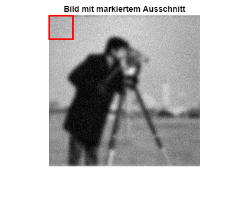

```matlab
S = noisy_img(topLeftCorner(1):bottomRightCorner(1), topLeftCorner(2):bottomRightCorner(2));

[counts, zi] = imhist(S);% Histogramm berechnen
p_s = counts / sum(counts);% Histogramm normieren -> Wahrscheinlichkeitsverteilung
z_mean = sum(zi .* p_s);% Mittelwert berechnen

% Varianz berechnen
variance_noise = sum((zi - z_mean).^2 .* p_s);
sigma_noise = sqrt(variance_noise);
sigma_noise_echt = sigma_noise*255;
% plotten
figure; bar(zi, p_s, 'EdgeColor','none');
axis([0.5 0.75 0.0 0.06])
hold on;

% Gaußverteilung
z = linspace(min(zi), max(zi), 1000);
gauss_pdf = (1/(sqrt(2*pi)*sigma_noise)) * ...
            exp(-(z - z_mean).^2 / (2*sigma_noise^2));
% Gaußverteilung (skaliert)
bin_width = zi(2) - zi(1);
gauss_pdf_scaled = gauss_pdf * bin_width;

plot(z, gauss_pdf_scaled, 'r', 'LineWidth', 2);
xlabel('Intensitätswert');
ylabel('p(z)');
title('Normiertes Histogramm mit Gaußverteilung');
hold off;
```

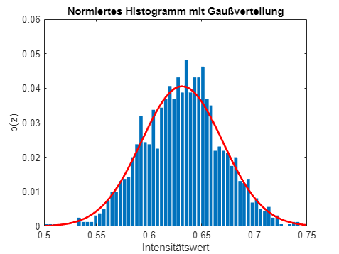

```matlab
fprintf('geschätztes Sigma Rauschen = %.4f\n', sigma_noise_echt);
```

```matlabTextOutput
geschätztes Sigma Rauschen = 9.8395
```

```matlab

% Für sigma_bild
% Histogramm berechnen
[counts_g, zi_g] = imhist(noisy_img);
histogram(noisy_img)
title("Histogram des degradierten verrauschten Bildes")
```

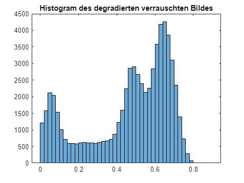

```matlab
p_s_g = counts_g / sum(counts_g);
z_mean_g = sum(zi_g .* p_s_g);
variance_g = sum((zi_g - z_mean_g).^2 .* p_s_g);
sigma_g_echt = sqrt(variance_g)*255;
varinace_originalbild = variance_g - variance_noise;
fprintf('standardabweichung degradiertes Bild= %.4f\n', sigma_g_echt);
```

```matlabTextOutput
standardabweichung degradiertes Bild= 55.4618
```


Aus den geschätzten Varianzen von Bild und Rauschen wird jetzt K berechnet:

 $$ K\approx \frac{\sigma_n^2 }{\sigma_f^2 } $$ 
```matlab
K = variance_noise/varinace_originalbild
```

```matlabTextOutput
K = 0.0325
```
# Inversfilter

Der Pseudo Inverse Filter ist definiert als

 $$ H^I (k,l)=\frac{H^* (k,l)}{|H(k,l)|^2 +\varepsilon } $$ 

Für $\varepsilon =0$ entspricht das dem einfachen Inversfilter

 $$ H^I (k,l)=\frac{H^* (k,l)}{|H(k,l)|^2 }=\frac{H^* (k,l)}{H\left(k,l\right)\cdot H^* (k,l)}=\frac{1}{H\left(k,l\right)} $$ 
```matlab
%Inversfilter
H_Inv = 1./H;

%pseudo Inversfilter
epsilon = 0.0005;
H_pseudoInv = conj(H)./(abs(H).^2+epsilon);
BildrestauriertPseudoInvFT = fft2(noisy_img).*H_pseudoInv;
BildrestauriertPseudoInv = ifft2(BildrestauriertPseudoInvFT);
imshow(real(BildrestauriertPseudoInv))
title("Restauriert mit Pseudo-Invers-Filter")
```


# Wiener Filter

 $$ W(u,v)=\left\lbrack \frac{H^* (u,v)}{|H(u,v)|^2 +NSR}\right\rbrack $$ 
## Idealfall

Das Rauschen und das Originalbild sind bekannt. Damit können die jeweiligen Leistungsdichtespektren berechnet werden: $NSR=\frac{S_{\eta } (u,v)}{S_f (u,v)}$ 


NSR ist dann eine Matrix mit der Größe MxN. Jede Frequenz wird bei der Rekonstruktion damit unterschiedlich gewichtet.  

```matlab
Sff_known = abs(OriginalbildFT).^2;
F_noise_gauss = fft2(noise_gauss);
Snn_known = abs(F_noise_gauss).^2;
NSR_known = Snn_known ./Sff_known;

Wiener_filter_known = conj(H) ./ (abs(H).^2+ NSR_known);
F_renew_known = Wiener_filter_known .* fft2(noisy_img);
I_renew_known = real(ifft2(F_renew_known));
I_renew_known = max(min(I_renew_known, 1), 0); %Werte außerhalb [0:1] aud 0 bzw 1 setzen

figure , imshow(I_renew_known);
title('Ideale Restauration')
```

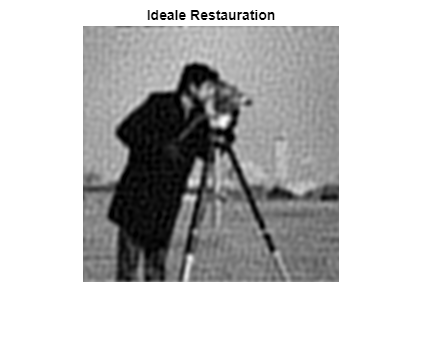

```matlab
MSE_known = immse(Originalbild, I_renew_known); %Qualität der Restauration beurteilen
```
## Realfall

Die Leistungsdichtespektren sind nicht bekannt. Es wird die Schätzung von K verwendet (Skalar). Alle Frequenzen werden somit gleich behandelt.

```matlab
NSR = K;
Wiener_filter = conj(H) ./ (abs(H).^2+ NSR );
F_renew = Wiener_filter .* fft2(noisy_img);
I_renew = real(ifft2(F_renew));
I_renew = max(min(I_renew, 1), 0);  %Werte außerhalb [0:1] aud 0 bzw 1 setzen
MSE_guess = immse(Originalbild, I_renew); %Qualität der Restauration beurteilen

figure
imshow(I_renew)
name = sprintf("RestauriertesBild_K%.3f.png", NSR);
title(name)
```

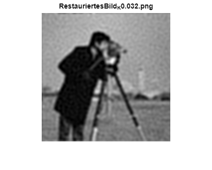

```matlab

Wiener_filter005 = conj(H) ./ (abs(H).^2+ 0.005 );
Wiener_filter015 = conj(H) ./ (abs(H).^2+ 0.015 );
Wiener_filter1 = conj(H) ./ (abs(H).^2+ 0.1 );
Wiener_filter5 = conj(H) ./ (abs(H).^2+ 0.5 );

Filter = {fftshift(H_Inv),fftshift(Wiener_filter005),fftshift(Wiener_filter015),fftshift(Wiener_filter),...
    fftshift(Wiener_filter1),fftshift(Wiener_filter5),fftshift(H)};
Filterlabels = {
    'Inversfilter', ...
    'Wiener-Filter (NSR = 0.005)', ...
    'Wiener-Filter (NSR = 0.015)', ...
    ['Wiener-Filter (NSR = ',num2str(NSR),')'], ...
    'Wiener-Filter (NSR = 0.1)', ...
    'Wiener-Filter (NSR = 0.5)', ...
    'Degradationsfilter'
};
frequenzgangVergleich(Filter,Filterlabels);
```

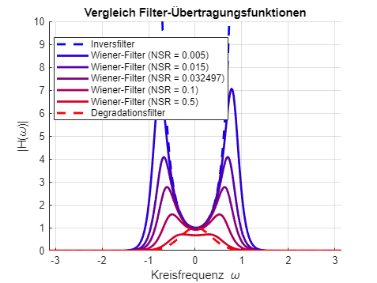


```matlab
% Hilfsfunktionen
function dispFreqDomainAmplitude(X_f, titleStr)
% Visualisiert den Amplitudengang eines Bildes im Frequenzraum.

    X = fftshift(X_f); % verschiebt das Spektrum in die Bildmitte
    
    X_mag = abs(X); % Betrag des komplexen Spektrums
    X_mag = log(1 + X_mag); % logarithmische Skalierung zur Kontrastverbesserung

    figure,imshow(X_mag, []);
    title(titleStr);
end

function showBoundingBox(img, topLeft, bottomRight)

    % Zeigt Bild mit markierten rechteckigen Bildausschnitt.
    figure;
    imshow(img, []);
    title('Bild mit markiertem Ausschnitt');
    hold on;

    % Koordinaten
    row1 = topLeft(1);
    col1 = topLeft(2);
    row2 = bottomRight(1);
    col2 = bottomRight(2);

    % Breite und Höhe
    width  = col2 - col1 + 1;
    height = row2 - row1 + 1;

    % Bounding Box zeichnen
    rectangle('Position', [col1, row1, width, height], ...
              'EdgeColor', 'r', ...
              'LineWidth', 2);

    hold off;
end

function pointSpreadGaus = createGaussianPSF(sigma, psf_size)
    if nargin < 2 || isempty(psf_size)
        psf_size = [floor(3*sigma + 1), floor(3*sigma + 1)];
    end

    h = psf_size(1);
    w = psf_size(2);

    x = (0:w-1) - floor(w/2);   % Spalten
    y = (0:h-1) - floor(h/2);   % Zeilen
    [X, Y] = meshgrid(x, y);

    pointSpreadGaus = 1/(2*pi*sigma^2) * exp(-(X.^2 + Y.^2)/(2*sigma^2));
    pointSpreadGaus = pointSpreadGaus / sum(pointSpreadGaus(:));
end

function frequenzgangVergleich(H_list, labels)

    numFilters = length(H_list);
    [M, N] = size(H_list{1});

    % Frequenzzentrum
    u0 = floor(M/2) + 1;

    % Frequenzachse
    omega = linspace(-pi, pi, N);

    % === Farbverlauf: Blau -> Rot ===
    blue = [0 0 1];
    red  = [1 0 0];
    colors = zeros(numFilters,3);
    for k = 1:numFilters
        alpha = (k-1)/(numFilters-1);   % 0 ... 1
        colors(k,:) = (1-alpha)*blue + alpha*red;
    end

    figure; hold on; grid on;

    for k = 1:numFilters
        H = H_list{k};
        H_mag = abs(H);

        % Horizontaler Frequenzschnitt
        H_slice = H_mag(u0, :);

        if k == 1 || k == numFilters
            lineStyle = '--';   % erster und letzter Plot gestrichelt
        else
            lineStyle = '-';    % alle anderen durchgezogen
        end

        plot(omega, H_slice, ...
            'LineWidth', 2, ...
            'Color', colors(k,:),...
            'LineStyle',lineStyle);
    end

    xlabel('Kreisfrequenz \omega');
    ylabel('|H(\omega)|');
    title('Vergleich Filter-Übertragungsfunktionen');
    legend(labels, 'Location', 'best');

    axis([-pi pi 0 10])

    hold off;
end


function H = Motionblur(I,a,T)
% Motion Blur: H(u,v) = T/(pi*u*a)*sin(pi*u*a)*exp(-j*pi*u*a)
% a: Bewegungslaenge in Pixeln
% T: Belichtungszeit
    [M,N] = size(I);
    [u, v] = meshgrid((-N/2:N/2-1)/N, (-N/2:N/2-1)/N);

    x = u * a; 
    % numerisch stabile sinc (x=0 -> 1)
    sincx = ones(size(x));
    idx = (x ~= 0);
    sincx(idx) = sin(pi*x(idx)) ./ (pi*x(idx));
    
    H = T * sincx .* exp(-1i*pi*x);
end

```
